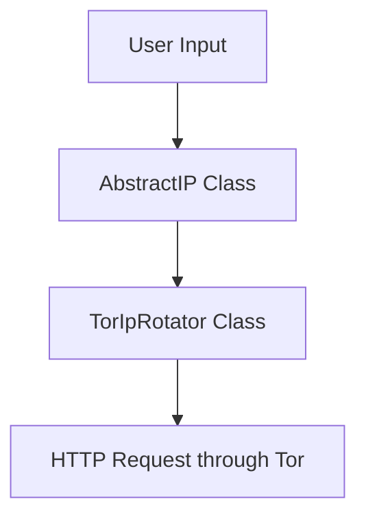

# circuit-rotator

## Project Description
- **Goal Achieved:**  
  The circuit-rotator project aims to provide a command-line tool for rotating IP addresses using the Tor network, enhancing anonymity and privacy for users making web requests.

- **Main Purpose:**  
  The primary purpose of this project is to enable users to mask their IP addresses by routing their requests through the Tor network, thereby protecting their identity and location while browsing or scraping web content.

- **Creation Date:**  
  2023-10-10

- **Version:**  
  v1.0.0

- **Status:**  
  Production

---

## Quick Start 🚀
To get started with the circuit-rotator, follow these commands:

```bash
# Clone the repository
git clone D:\Programming\Projects_Finished\Code2Doc\Code2Docs_paid_llms\storage\repositories\circuit-rotator
cd circuit-rotator

# Install dependencies
pip install -r requirements.txt

# Run the tool
python main.py
```

---

## Table of Contents
1. [Architecture Overview](#architecture-overview)
2. [Technical Stack](#technical-stack)
3. [Installation & Setup](#installation--setup)
4. [Usage Examples](#usage-examples)
5. [Error Handling](#error-handling)
6. [Testing](#testing)
7. [Troubleshooting](#troubleshooting)
8. [Contributing](#contributing)

---

## Architecture Overview

### System Architecture
This is a command-line tool designed in Python that utilizes the Tor network for IP rotation. The main components include classes for handling IP rotation and making HTTP requests through Tor.



### Key Components
- **AbstractIP:** An abstract base class that defines the interface for IP rotation.
- **TorIpRotator:** A concrete implementation of the AbstractIP class that handles the specifics of rotating IP addresses using the Tor network.

### Data Flow
Data flows from the user input through the `TorIpRotator` class, which manages the connection to the Tor network and performs the IP rotation. The tool then makes HTTP requests using the rotated IP address.

---

## Technical Stack

### Core Technologies
- **Language:** Python 3.9+
- **Framework:** Unknown
- **Database:** None
- **Cache:** None

### Dependencies
```bash
# Main dependencies
httpx==0.23.0
stem==1.8.0
python-dotenv==0.20.0
```

---

## Installation & Setup

### Prerequisites
- Python 3.9 or higher
- Access to the Tor network
- Basic command line knowledge

### Installation Steps
```bash
# Clone the repository
git clone D:\Programming\Projects_Finished\Code2Doc\Code2Docs_paid_llms\storage\repositories\circuit-rotator
cd circuit-rotator

# Install dependencies
pip install -r requirements.txt
```

### Environment Configuration
```bash
# Copy environment template
cp .env.example .env

# Edit configuration
# Ensure Tor is running and accessible
```

---

## Usage Examples

### Basic Usage
```python
# Basic example of using the TorIpRotator
from tor_ip_rotator import TorIpRotator

rotator = TorIpRotator()
response = rotator.make_request_through_tor("http://example.com")
print(response)
```

### Advanced Usage
```python
# Advanced usage with error handling
from tor_ip_rotator import TorIpRotator

rotator = TorIpRotator()

try:
    response = rotator.make_request_through_tor("http://example.com")
    print(f"Response: {response}")
except Exception as e:
    print(f"An error occurred: {e}")
```

---

## Error Handling

### Common Error Codes
| Error | Description | Solution |
|-------|-------------|----------|
| ConnectionError | Unable to connect to the Tor network | Ensure Tor is running and accessible |
| HTTPError | Invalid response from the target URL | Check the URL and try again |

### Exception Handling Pattern
```python
# Exception handling pattern
try:
    response = rotator.make_request_through_tor("http://example.com")
except ConnectionError as e:
    print(f"Connection error: {e}")
except HTTPError as e:
    print(f"HTTP error: {e}")
```

---

## Testing

### Running Tests
```bash
# Run all tests
pytest tests/
```

### Test Structure
```
tests/
├── unit/
└── integration/
```

---

## Troubleshooting

### Common Issues

#### Issue: Unable to connect to Tor
**Symptoms:** The application fails to make requests through Tor.  
**Solution:** 
```bash
# Ensure Tor is installed and running
tor
```

#### Issue: HTTP requests failing
**Symptoms:** The application returns HTTP errors.  
**Solution:** Check the target URL for correctness and ensure it is accessible.

---

## Contributing

### Development Workflow
1. Fork the repository.
2. Create a feature branch.
3. Make your changes.
4. Run tests: `pytest tests/`.
5. Submit a pull request.

---

## Additional Resources
- **Repository:** D:\Programming\Projects_Finished\Code2Doc\Code2Docs_paid_llms\storage\repositories\circuit-rotator
- **Documentation:** [Link to documentation if available]
- **Issues:** [Link to issue tracker if available]

---

*Documentation generated on: 2023-10-10*  
*Project Version: v1.0.0*
